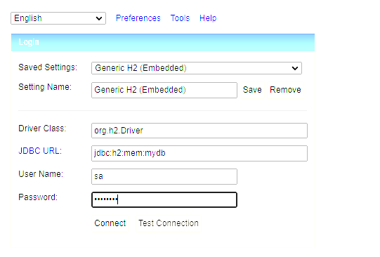
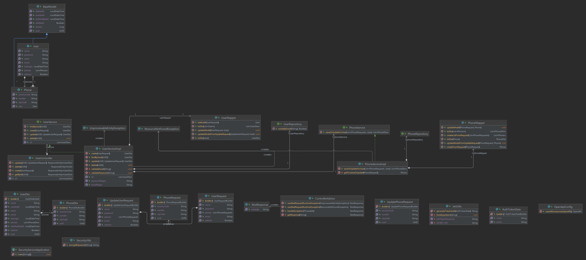

# Security Service
Microservice creates as a part of selection process for Java developer in Nisum Company

### Features

* Users CRUD
* JWT token generation
* Api documentation
* Unit test

# Getting Started

### Technical implementation requirement and usage

* Java 17
* Spring boot 3.1.2
* Maven 3.9.3
* Flyway 9.20.0

### Guides
The following guides illustrate how to use features concretely:

* Run the project locally with default profile. Default port 8080
* Go to http://localhost:8080/swagger-ui/index.html to view api documentation
* Import postman collection "nisum-test.json" available in resources path of repository
* This Project uses H2 memory database. You can access database using http://localhost:8080/h2-console password = password

### Solution Diagram
The following image contains the class diagram for mico service solution:

